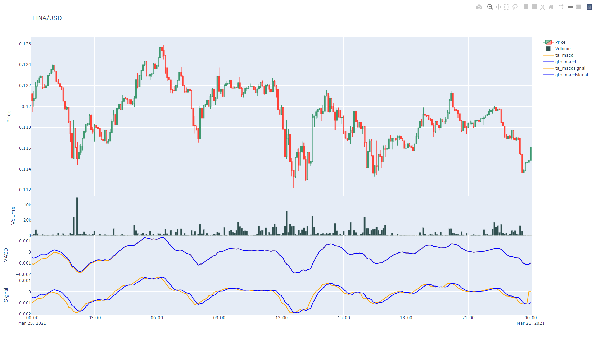
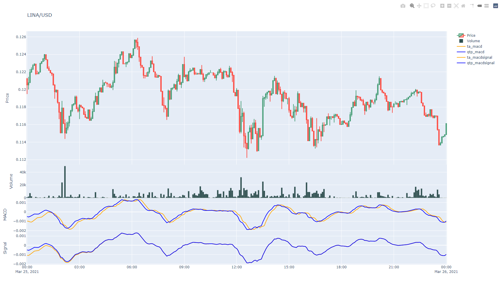

# **Pourquoi la stratégie de TheForce ne fonctionne pas**
Document original [ici](https://brookmiles.github.io/freqtrade-stuff/2021/03/29/why-theforce-doesnt-work/)

29-03-2021

La stratégie TheForce obtient des résultats étonnants en backtest, mais ne fonctionne pas en live.
Les bénéfices fous du backtest ne sont visibles qu'en utilisant signalperiod=1 avec ta.MACD(dataframe,12,26,1).
Si nous changeons l'implémentation de la MACD de ta-lib, à qtpylib, la plupart des profits disparaissent :

```
# MACD (Magic Profits)
macd = ta.MACD(dataframe,12,26,1)
dataframe['macd'] = macd['macd']
dataframe['macdsignal'] = macd['macdsignal']
dataframe['macdhist'] = macd['macdhist']

# MACD (No Magic Profts)
macd = qtpylib.macd(dataframe['close'],12,26,1)
dataframe['macd'] = macd['macd']
dataframe['macdsignal'] = macd['signal']
dataframe['macdhist'] = macd['histogram']

================================================================ STRATEGY SUMMARY ===========================================================
| Strategy          | Buys | Avg Profit %   | Cum Profit %  | Tot Profit USD    | Tot Profit %  | Avg Duration  | Wins  | Draws | Losses    |
|-----------------+--------+----------------+---------------+-------------------+---------------+---------------+-------+-------+-----------|
| TheForceV7        | 1872 | 0.88           | 1641.61       | 24501.162         | 2450.12       | 0:56:00       | 1297  | 0     | 575       |
| TheForceV7\_test  | 1853 | 0.11           | 209.05        | 506.040           | 50.60         | 0:32:00       | 706   | 0     | 1147      |
=============================================================================================================================================

```

**Pourquoi ?**

Ce qui semble se passer est que ta-lib, pour une raison quelconque, triche en regardant dans le futur par 2 bougies lorsque signalperiod=1.
Voici une superposition de chaque implémentation utilisant signalperiod=2, les résultats convergent rapidement et se superposent les uns aux autres.


Il s'agit d'une superposition de chaque mise en œuvre en utilisant signalperiod=1, la version ta-lib est tournée vers l'avenir par deux bougies. Vous pouvez voir que la ligne de signal de ta-lib est deux bougies "en avance", prédisant le mouvement futur du prix.



Juste une double vérification, voici chaque implémentation utilisant signalperiod=1, mais la version ta-lib a été avancée de deux bougies en utilisant .shift(2). La ligne macd est maintenant en retard de deux bougies, et la ligne de signal s'aligne à nouveau avec l'implémentation qtpylib.



Malheureusement, la stratégie TheForce se projette dans l'avenir pour prédire la direction du mouvement des prix, ce qui ne peut pas se produire en direct ou en dry-run (simulation en direct), à moins que vous ne soyez un vrai _Jedi_.